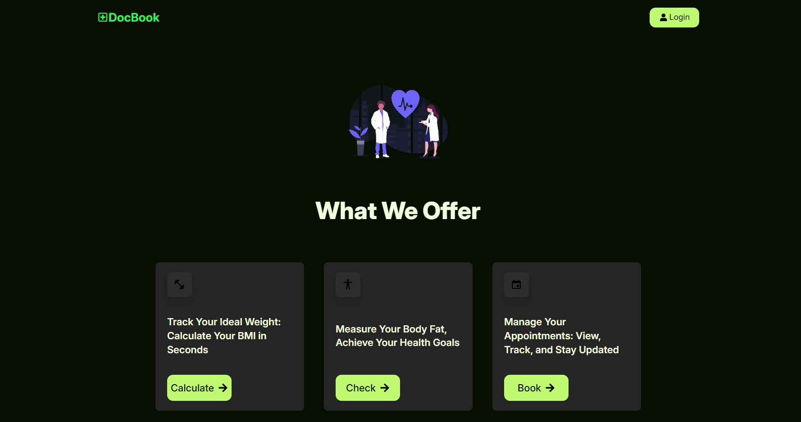
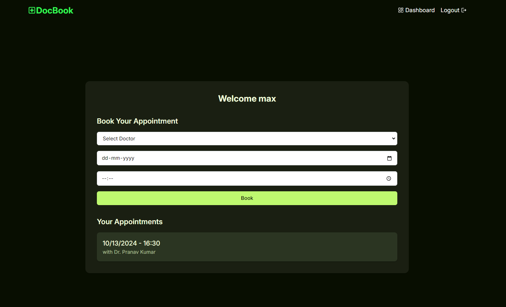
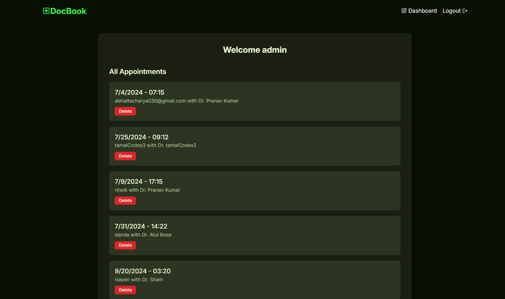
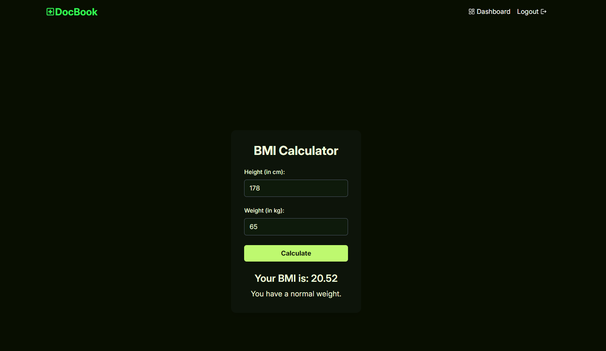

# DocBook








## What is it?

DocBook is a dynamic appointment booking application designed to enhance communication and scheduling between doctors, patients, and administrators. Built using the MERN stack with Redux Toolkit for state management, DocBook offers a streamlined workflow for managing appointments and patient care. The application also features health tools like **BMI calculation** and **body fat percentage checks**, making it a one-stop solution for healthcare management.

## Live Link

[https://docbook-v1.vercel.app](https://docbook-v1.vercel.app)

---

## Table of Contents

- [Features](#features)
- [Tech Stack](#tech-stack)
- [Installation](#installation)
- [Usage](#usage)
- [Contributing](#contributing)

---

## Features

- **Role-Based Login**: Secure and personalized access for **Admins**, **Doctors**, and **Patients**.
- **Appointment Management**: Easy scheduling and tracking of doctor appointments.
- **User Profiles**: Comprehensive profiles for both doctors and patients.
- **BMI Calculator**: Calculate Body Mass Index (BMI) for tracking personal health.
- **Body Fat Percentage Calculator**: Measure body fat percentage to monitor fitness levels.

---

## Tech Stack

- **Frontend**: React, Redux Toolkit, Tailwind CSS, Framer Motion
- **Backend**: Node.js, Express.js
- **Database**: MongoDB
- **Authentication**: JWT (JSON Web Tokens)
- **Deployment**: Vercel, onRender

---

## Installation

To get a local copy up and running, follow these steps:

1. **Clone the repository**

   ```sh
   git clone https://github.com/isayanpal/docBook.git
   ```

2. **Navigate to the project directory**

   ```sh
   cd docBook
   ```

3. **Install backend dependencies**

   ```sh
   cd server
   npm install
   ```

4. **Create a `.env` file in the `server` directory and add your environment variables:**

   ```plaintext
   MONGO_URI=your mongo string
   PORT = 5000
   JWT_SECRET = yoursecret
   JWT_EXPIRE=30d
   `

   ```

5. **Install frontend dependencies**

   ```sh
   cd client
   npm install
   ```

## Usage

1. **Start the backend server**

   ```sh
   cd server
   npm run dev
   ```

2. **Start the frontend server**

   ```sh
   cd client
   npm run dev
   ```

3. Open your browser and navigate to `http://localhost:5173/`.

## Contributing

Contributions are what make the open-source community such an amazing place to learn, inspire, and create. Any contributions you make are **greatly appreciated**.

1. Fork the Project
2. Create your Feature Branch (`git checkout -b feature/AmazingFeature`)
3. Commit your Changes (`git commit -m 'Add some AmazingFeature'`)
4. Push to the Branch (`git push origin feature/AmazingFeature`)
5. Open a Pull Request

## Happy Coding ❤️
